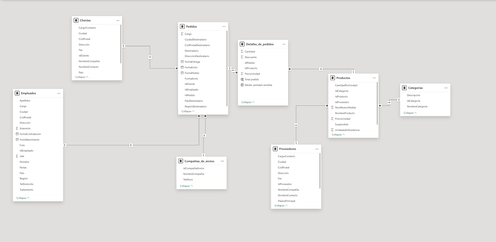

# 📊 Neptuno: End-to-End Business Intelligence Project

This project demonstrates a complete data workflow: staging a DataBase in Excel, and building a comprehensive analytical dashboard in Power BI.

## 🔄 Data Pipeline
1. **Staging:** Original DB was exported to Excel for initial validation.
2. **Visualization:** Data was imported into Power BI for modeling and dashboard creation.

## 🏗️ Data Architecture: Snowflake Schema
The data model follows a **Snowflake Schema** due to the normalized nature of the source relational database. 

* **Normalization:** Dimensions like `Categories` are connected via `Products`, reducing data redundancy.
* **Relationships:** Managed complex One-to-Many relationships between `Customers`, `Orders`, and `Suppliers` to ensure data integrity.
* **Optimization:** Optimized DAX queries to maintain high performance across multiple relationship levels.

## 🧠 DAX
* **Average Sold Quantity:** `Media cantidad vendida = AVERAGE(Detalles_de_pedidos[Cantidad])`
* **Total Order** `Total pedido = RELATED(Productos[PrecioUnidad]) *Detalles_de_pedidos[Cantidad]`

## 🛠️ Tech Stack
* **Excel:** Intermediate data handling.
* **Power BI & DAX:** Data modeling and interactive visualization.

## 📈 Dashboard Preview

