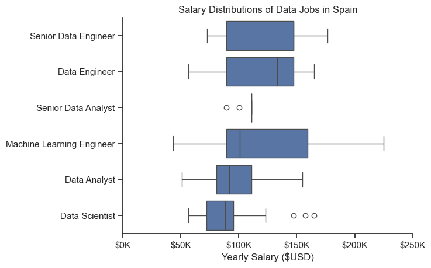
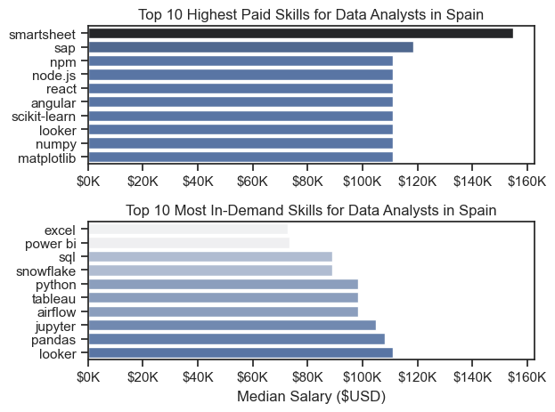
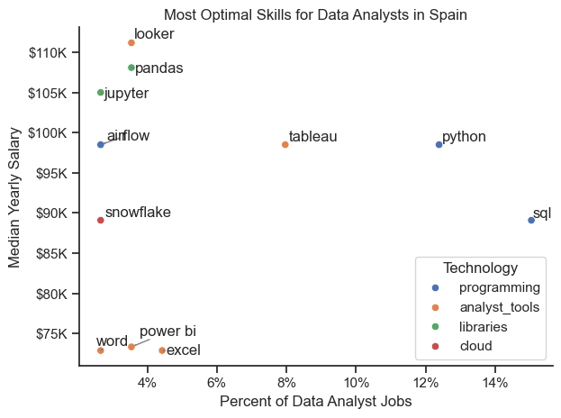

# Overview

Welcome to my analysis of the data job market in Spain, focusing on data analyst roles. This project was created out of a desire to navigate and understand the job market more effectively. It delves into the top-paying and in-demand skills to help find optimal job opportunities for data analysts.

The data sourced from [Luke Barousse's Python Course](https://lukebarousse.com/python) which provides a foundation for my analysis, containing detailed information on job titles, salaries, locations, and essential skills. Through a series of Python scripts, I explore key questions such as the most demanded skills, salary trends, and the intersection of demand and salary in data analytics.

# The Questions

Below are the questions I want to answer in my project:

1. What are the skills most in demand for the top 3 most popular data roles?
2. How are in-demand skills trending for Data Analysts?
3. How well do jobs and skills pay for Data Analysts?
4. What are the optimal skills for data analysts to learn? (High Demand AND High Paying) 

# Tools I Used

For my deep dive into the data analyst job market, I harnessed the power of several key tools:

- **Python:** The backbone of my analysis, allowing me to analyze the data and find critical insights.I also used the following Python libraries:
    - **Pandas Library:** This was used to analyze the data. 
    - **Matplotlib Library:** I visualized the data.
    - **Seaborn Library:** Helped me create more advanced visuals. 
- **Jupyter Notebooks:** The tool I used to run my Python scripts which let me easily include my notes and analysis.
- **Visual Studio Code:** My go-to for executing my Python scripts.
- **Git & GitHub:** Essential for version control and sharing my Python code and analysis, ensuring collaboration and project tracking.

# Data Preparation and Cleanup

This section outlines the steps taken to prepare the data for analysis, ensuring accuracy and usability.

## Import & Clean Up Data
I start by importing necessary libraries and loading the dataset, followed by initial data cleaning tasks to ensure data quality.

```python
    # Importing Libraries
    import ast
    import pandas as pd
    import seaborn as sns
    from datasets import load_dataset
    import matplotlib.pyplot as plt  
    
    # Loading Data
    dataset = load_dataset('lukebarousse/data_jobs')
    df = dataset['train'].to_pandas()
    
    # Data Cleanup
    df['job_posted_date'] = pd.to_datetime(df['job_posted_date'])
    df['job_skills'] = df['job_skills'].apply(lambda x: ast.literal_eval(x) if pd.notna(x) else x)
```

## Filter Spain's Jobs

To focus my analysis on the Spanish job market, I apply filters to the dataset, narrowing down to roles based in the Spain.

```python
df_ES = df[df['job_country'] == 'Spain']

# The Analysis
Each Jupyter notebook for this project aimed at investigating specific aspects of the data job market. Here’s how I approached each question:

## 1. What are the most demanded skills for the top 3 most popular data roles?

To find the most demanded skills for the top 3
most popular data roles, I filtered those positions
and got the top 5 for these top 3 roles. This query 
highlights the most popular job titles and their top 
skills showing which skills I should pay attention to
depending on the role I'm interested.


### Visualize Data
```python
    fig, ax = plt.subplots(len(job_titles), 1)

    sns.set_theme(style='ticks')
    
    for i, job_title in enumerate(job_titles):
        df_plot = df_skills_perc[df_skills_perc['job_title_short'] == job_title].head()
        sns.barplot(data=df_plot, x='skill_percent', y='job_skills', ax=ax[i], hue='skill_count', palette='dark:b')
    plt.show()
```

### Results


*Bar chart visualizing the likelihood of skills requested
for job postings for data jobs.*

### Insights

- Python is a versatile and highly demanded skill in all the 3 roles, followed by SQL.
In Data Engineers(56.76%) and Data Scientists (67.95%), this skill is predominant, with over the 50% posts listing it. 
For Data Analysts, SQL is the most demanded skill (50%), followed by Data management and visualization
tools like Excel, Power BI, and Tableau.


- In Data Engineers and Data Scientists, the skills sought are more technical, including AWS, Azure, and Spark,
leaving behind the management tools posted for Data Analysts.

## 2. How are in-demand skills trending for Data Analysts?
 
   sns.lineplot(data=df_plot, dashes=False, palette='tab10')
    sns.set_theme(style='ticks')
    sns.despine()
```python
    from matplotlib.ticker import PercentFormatter
    ax = plt.gca()
    ax.yaxis.set_major_formatter(PercentFormatter(decimals=0))
    
    # For practice only
    for i in range(5):
        plt.text(11, df_plot.iloc[-1, i], df_plot.columns[i], fontsize=9)
```


*Line chart visualizing the most demanded skill for Data Analysts
in Spain during the year.*
### Insights

- SQL remains the most consistently demanded skill throughout the year, although it shows 
a decline in the first two months.


- Python has two important changes during the year, one in July-August, when the demand is
higher than usual, being the second most demanded skill.


- Power BI has better demand than its competitor Tableau, specially during the end of each 
quarter, which coincides with quarterly-reports, and especially with an important demand 
peak at the end of the year.


## 3. How well do jobs and skills pay for Data Analysts?

### Salary Analysis
#### Results

```python
    sns.boxplot(data=df_ES_top, x='salary_year_avg', y='job_title_short', order=job_order)
    sns.set_theme(style='ticks')
    sns.despine()

    plt.xlim(0, 250000)
    ticks_x = plt.FuncFormatter(lambda y, pos: f'${int(y/1000)}K')
    plt.gca().xaxis.set_major_formatter(ticks_x)
    plt.show()
```


*Boxplot visualizing the salary distributions for the
top 6 data job roles.

#### Insights

- Data Engineers have the highest median salary in Spain, even surpassing other experienced roles
like Senior Data Analysts. It's important to notice that the outliers for Data Engineers are also 
considerable.


- Machine Learning Engineers show the widest salary spread, with salaries reaching up to $240k
while also including the lowest salaries in the dataset. Experience and skills may play an
important role in their salary.


- For Senior Data Analysts the salary spread is very narrow, especially compared to is previous role,
Data Analysts, which indicates that more experience industry may lead to higher payrolls.

### Highest paid and most demanded skills for Data Analysts

```python
    # Top 10 Highest Paid Skills for Data Analysts
sns.barplot(data=df_DA_ES_top_pay, x='median', y=df_DA_ES_top_pay.index, hue='median', ax=ax[0], palette='dark:b_r')

# Top 10 Most In-Demand Skills for Data Analysts'
sns.barplot(data=df_DA_ES_top_skills, x='median', y=df_DA_ES_top_skills.index, hue='median', ax=ax[1], palette='light:b')
```

*Two separate bar graphs visualizing the highest paid skills
and most in-demand skills for Data Analysts in Spain.*

#### Insights
- In the highest-paid skills, we found different kinds. At the top, we found software tools like Smartsheet 
and SAP, followed by JavaScript development ecosystems. It's important to mention that these skills, although
they are highly paid, when checking the data, are also less demanded.


- Skills related to data management and visualization, like scikit-learn, looker and python libraries like numpy, 
are highly paid and also appear in the most in-demand skills.

- There's a clear patter in the most in-demand skills vs its median salary. Tools like Excel that are commonly known,
are not the ones with the highest median salary, while more specialized data manipulation skills like python and its
libraries, are less in demand but with higher salaries.

- Data management tools like Excel and SQL are at the top of the most demanded skills, while visualization tools like
Power BI shows a leading preference over Tableau, due to its easier integration with Microsoft Ecosystems. Even though 
Tableau seems to be less in-demand, it has a higher median Salary than its competitor.


## 4. What is the most optimal skill to learn for Data Analysts?

#### Visualize Data

```python
    sns.scatterplot(
    data=df_DA_skills_plot,
    x='skill_percent',
    y='median_salary',
    hue='technology'
    )
    plt.show()
```


*A scatter plot visualizing the most optimal skills (high pay & high demand)
for Data Analysts in Spain*

#### Insights

- The scatter polot show that the 'programming' skills like Python and SQL 
are the most relevant skills for Data Analysts in Spain, with over a 
12%(Python) and 14%(SQL) in job postings. Compared to other categories, 
this one is the one with the highest pay.


- For analyst tools, that are crucial for this role,  Tableau is over Power BI 
and Excel, appearing in more than the 8% of job postings.

# What I Learned

Throughout this project, I gained a deeper understanding of the data analyst job market while strengthening my technical skills in Python, particularly in data manipulation and visualization. Key takeaways from the project include:

- **Advanced Python Skills**: Leveraging libraries such as Pandas for data manipulation, and Seaborn and Matplotlib for visualization enabled me to perform complex analyses more efficiently.
- **The Value of Data Cleaning**: I realized that meticulous data cleaning and preparation are essential to ensure the accuracy and reliability of any analysis.
- **Strategic Skill Assessment**: The project highlighted the importance of aligning personal skills with market demand. By understanding the link between skill demand, salary, and job availability, one can make more informed career decisions in the tech industry.

# Insights

This project revealed several key insights into the data analyst job market:

- **Skill Demand and Salary Correlation**: There is a strong correlation between in-demand skills and the salaries they command. Advanced and specialized skills, such as Python and SQL, tend to lead to higher compensation.
- **Market Trends**: Skill demand is constantly evolving, reflecting the dynamic nature of the data analytics field. Staying updated with these trends is essential for career growth.
- **Economic Value of Skills**: Identifying skills that are both highly sought-after and well-compensated can help data analysts prioritize learning to maximize their economic impact.

# Conclusion

Exploring the data analyst job market has been highly informative, highlighting the critical skills and trends that shape this evolving field. These insights enhance my understanding and offer actionable guidance for anyone seeking to advance their career in data analytics. As the market continues to shift, ongoing analysis and adaptation are essential. This project provides a solid foundation for future explorations and underscores the importance of continuous learning in the data field.
